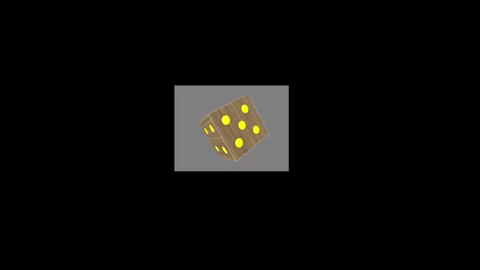
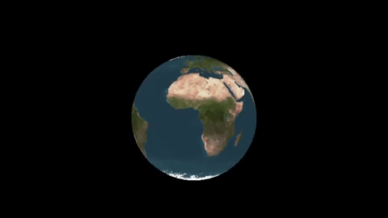
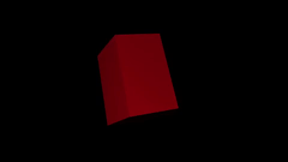
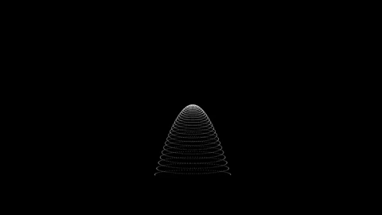

# OPENGL TOYS

The objective of this project is to study OpenGL. Four different objects were built, that being the following:

## Dice



## Globe



## Prism



## Paraboloid



## Dependecies

This project has the following dependecies

- [Python](https://www.python.org/) 3.7.12 (preferably) but it might also work with other python3 versions.
- [pip](https://pip.pypa.io/en/stable/)

## Setup

Run the command below on your terminal to setup the right python package depencies for the project to run properly. Keep in mind that you must be on the root directory of this project to run the commands.

```
$ make setup
```

## Run

### Dice

```
$ make run_dice
```

### Globe

```
$ make run_globe
```

### Prism

```
$ make run_prism
```

### Paraboloid

```
$ make run_paraboloid
```
